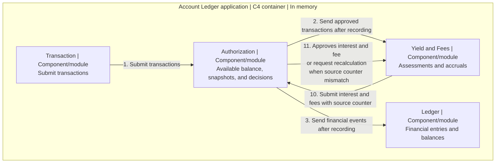

# Architecture and Tradeoffs

This [Part 2 deliverable](exercise-inputs/exercise-statement.md#part-2-architecture--tradeoffs-document) describes the design and tradeoffs for the [live defense](exercise-inputs/exercise-statement.md#how-youll-be-evaluated).

## Scope and tradeoffs

Keep Ledger, Authorization, and Yield and Fees in one system that runs in memory. One combined module needs less structure but entangles responsibilities; separate systems add coordination overhead. Three domain modules keep ownership explicit through internal interfaces.

The scope excludes a web layer, persistence, database, UI, system error corrections, and taxes on yield. Language, technology, process count, and implementation primitives remain unspecified.

## Domains and module boundaries

Module identifiers below are illustrative.

* **Authorization (`authorization`)** owns operational transactions, snapshots, holds, and decisions. A new hold requires nonnegative remaining availability. After recording, it sends approved transactions to Yield and Fees and committed financial movements to Ledger.
* **Ledger (`ledger`)** owns financial entries and current and historical accounting balances. Each movement becomes one balanced journal entry with equal debit and credit postings in the same currency. Book accounts need not be customer accounts. It preserves booking and value dates and owns no authorization, interest, or fee policy.
* **Yield and Fees (`interest_and_fees`)** owns daily assessments, accruals, and calculation records. It reconstructs dated bases from approved transactions and initial account state.

Authorization never reads Ledger; Yield consumes no balances. Each module changes only its own state through explicit interfaces.

## Snapshots and concurrency

Transactions retain their supplied `transaction_id` across retries and redelivery. Financial events and hold changes each create a new snapshot and advance the account's `event_counter` by one, starting at **1**. `last_event_counter` identifies its latest snapshot version. A decline records only its decision and ID, preserving funds, holds, snapshot and counter. History is immutable.

Ignore a recorded ID, including a declined request's ID, before calculating or inspecting its content, even if the content differs. It produces no repeated effect, snapshot, or counter increment. For an unrecorded transaction that creates a snapshot, calculate from the latest snapshot and set `candidate.event_counter = base.last_event_counter + 1`. The initial account state gives candidate **1**, even after earlier declines.

Check ID uniqueness and the unchanged calculation base indivisibly with recording the outcome: decision only for a decline, transaction plus snapshot otherwise. Apply any financial or hold effect in that same operation. If the base changes, reread and recalculate with the same ID before recording. For a snapshot candidate, `latest_snapshot.last_event_counter >= candidate.event_counter` detects that advance. Never attach a newer counter to an old result. Uncommitted attempts publish no Ledger posting.

## Calculation version validation

Authorization can advance while Yield receives transactions, calculates, or sends a payment. Each attempt uses one complete account version, identified by `source_event_counter`. New transactions that advance that account's snapshot version require a new attempt; they are not mixed into the running calculation.

For example, Yield has the approved transactions through counter **10** and starts calculating. Authorization has recorded approved transaction **11**, but it has not reached Yield yet. Yield sends its result with `source_event_counter = 10`. Authorization's snapshot is already at **11**, so it records no payment and requests recalculation. Yield must receive transaction **11** before recalculating this result.

In addition to [snapshot validation](#snapshots-and-concurrency), a new payment with `event_counter = N` requires both Authorization's current snapshot counter and `source_event_counter` to equal **N-1**. Check the ID and both counters, apply the credit or debit, and save payment plus snapshot indivisibly. A mismatch records no payment and requests recalculation with the same supplied ID.

The recorded-ID rule also applies to payments: redelivery requests no recalculation. Fee submissions use the same source counter check. A declined authorization leaves the account version unchanged and does not invalidate an otherwise current calculation.

The financial booking cutoff does not replace this operational check. An excluded booking may leave the amount unchanged while invalidating its source counter. Establishing complete inputs for that account version remains [unresolved](deliverables/AMBIGUITIES.md#yield-calculation-and-payment).

## Daily calculation and capitalization rules

Under the [daily timing decision](deliverables/AMBIGUITIES.md#daily-calculation-timing), the job in day D references D-1. Select cumulative inputs with `booking_date <= D-1`, then effects with `value_date <= calculated day`. The job's accrual and payment are outputs. Operational effects remain immediate.

Keep unpaid accruals and adjustments separate from posted money. Under the [component settlement decision](deliverables/AMBIGUITIES.md#interest-adjustments-wait-for-payment), link each eligible component to exactly one payment, preserve earlier payments, and retain settled components for later difference calculations. Pending interest is outside ledger and available balances and earns no interest.

The [payment decision](deliverables/AMBIGUITIES.md#interest-payment-schedule-and-capitalization) separates the accrual period from the booking cutoff. Record each credit with its actual payment dates, after its calculation. Subsequent balance calculations include it according to those dates. [Study 10](research/10-interest-capitalization-research.md) explains the schedule and examples.

Apply the [daily interest rule](exercise-inputs/business-rules-corrected.md#approved-interpretation-daily-interest-calculation) and [payment rules](exercise-inputs/business-rules-corrected.md#approved-interpretation-active-calculations). [Pending decisions](deliverables/AMBIGUITIES.md#pending-calculation-decisions) include calendar and payment limits, negative totals, and calculation-record validation.

## Overdraft fee assessment and corrections

Apply the [daily input selection](#daily-calculation-and-capitalization-rules). For historical day H, exclude only H's own fee components and adjustments from its dated balance; retain other periods' fees and refunds at their actual value dates. Holds and pending interest do not enter the base. This [assessment method](deliverables/AMBIGUITIES.md#overdraft-fee-assessment-base) prevents a fee from sustaining itself without changing the reported ledger balance.

Configure fees by account type in its own currency under the [approved currency exception](exercise-inputs/business-rules-corrected.md#approved-exception-overdraft-fee-currency).

Calculate `corrected fee - (original fee + all earlier adjustments)`, including adjustments excluded from the assessment base. Append only a nonzero difference, linked to its trigger with a breakdown by day. Positive differences debit; negative differences refund. Review periods chronologically.

For legitimate late adjustments, both dates are the correction day. Reversal refunds use the exception below. [Study 07](research/07-overdraft-fees-research.md#calculation-snapshots) provides worked examples.

## Reversal compensation

Reverse principal once with its supplied dates. Under [method B](deliverables/AMBIGUITIES.md#reversal-compensation), recalculate affected fees and interest, including later periods whose bases change within the calculation boundary. Append only linked differences from original amounts plus all prior adjustments. This does not automatically refund every fee.

Book each fee refund on the correction day and value it at the original charge's value date, which may differ from the assessed balance day. Funds become available when recorded; historical dates change reconstructed balances without rewriting records. Interest differences keep both correction-day dates and follow [pending payment treatment](#daily-calculation-and-capitalization-rules). Corrections never automatically reevaluate authorizations.

The [simulation](research/examples/08-reversal-15-day-simulation.md) illustrates the policy; its calendar and results are not replay requirements.

## Ledger delivery

Authorization records transaction plus snapshot before forwarding financial data. Ledger posting is a separate operation and uses the same transaction ID to prevent duplicate journal entries. Hold-only changes and declines create no financial posting.

After recording, retry failed delivery or posting with the recorded ID and original dates; do not reapply operational effects or reauthorize. Delivery may be asynchronous, so accounting reports can lag operational snapshots. Recovery and reporting readiness remain unresolved.

## Transaction entry and test replay

`transaction` is the technical entry module and submits only to Authorization. The separate test suite or script replays the supplied event order and inspects daily balances, assessments, authorization states, and errors.

Every financial effect follows the snapshot path. [Confirmed settlements](exercise-inputs/business-rules-corrected.md#approved-interpretation-settlements) record their debit even when a hold is missing or availability is negative. Keep reservation changes separate from financial postings: a [release](deliverables/AMBIGUITIES.md#hold-settlement-and-release) changes availability without a credit.

Use [study 13](research/13-acceptance-criteria-research.md#analysis) for criterion analysis, [AMBIGUITIES](deliverables/AMBIGUITIES.md#pending-calculation-decisions) for decisions and open results, and [REJECTED](deliverables/REJECTED.md) for recorded refusals.

### E10 installment allocation

The [approved allocation](deliverables/AMBIGUITIES.md#e10-installment-allocation) preserves E10's credit exactly. [Study 11](research/11-installments-research.md#small-example) explains the remainder convention; [NUMBERS](deliverables/NUMBERS.md#e10-installment-values) records the inputs and calculations.

If installments are individual financial credits, link them to E10 without also crediting the parent. Representation, IDs, event count and counter effects remain unspecified.

## C3 component view

Here, C3 means [C4 Level 3: components](https://c4model.com/diagrams/component). This logical view uses [notation independent C4](https://c4model.com/diagrams/notation) and shows transaction interactions; test reporting is omitted. Forwarding may be asynchronous. Neither Authorization nor Yield consumes Ledger data. The process model remains unspecified.

Numbers identify interactions, not event counters or one continuous sequence. Receiving transactions updates the history; calculation has an independent trigger.

## Potential Future Separation

Yield and fee assessment share dated inputs and correction mechanisms, so one module keeps the exercise small. A future overdraft credit facility could justify a separate Credit domain. Its limit, reservation, and repayment policies would require new decisions; the current scope covers fees only.
