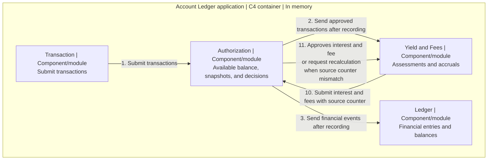

# Architecture and Tradeoffs

This [Part 2 deliverable](exercise-inputs/exercise-statement.md#part-2-architecture--tradeoffs-document) describes the design and tradeoffs for the [live defense](exercise-inputs/exercise-statement.md#how-youll-be-evaluated).

## Scope and tradeoffs

Keep Ledger, Authorization, and Yield and Fees in one system that runs in memory. One combined module needs less structure but entangles responsibilities; separate systems add coordination overhead. Three domain modules keep ownership explicit through internal interfaces.

The scope excludes a web layer, persistence, database, UI, system error corrections, and taxes on yield. BANK-SPEC uses one Clojure/JVM process, exact BigDecimal arithmetic, persistent data structures and small in-memory adapters. [deps.edn](../deps.edn) pins its dependencies.

## Domains and module boundaries

The public modules are `account-ledger.authorization.ports.api-server`, `account-ledger.ledger.ports.api-server` and `account-ledger.yield-fees.ports.api-server`. [API documentation](api.md) describes their contracts.

* **Authorization (`authorization`)** owns operational transactions, snapshots, holds, and decisions. A new hold requires nonnegative remaining availability. After recording, it sends approved transactions to Yield and Fees and committed financial movements to Ledger.
* **Ledger (`ledger`)** owns financial entries and current and historical accounting balances. Each movement becomes one balanced journal entry with equal debit and credit postings in the same currency. Book accounts need not be customer accounts. It preserves booking and value dates and owns no authorization, interest, or fee policy.
* **Yield and Fees (`interest_and_fees`)** owns daily assessments, accruals, calculation records and financial intents. It reconstructs dated bases from approved transactions and initial account state, then saves each command before submitting its financial effect.

Authorization never reads Ledger; Yield consumes no balances. Each module changes only its own state through explicit interfaces.

## Snapshots and concurrency

Transactions retain their supplied `transaction_id` across retries and redelivery. Financial events and hold changes each create a new snapshot and advance the account's `event_counter` by one, starting at **1**. `last_event_counter` identifies its latest snapshot version. A decline records only its decision and ID, preserving funds, holds, snapshot and counter. History is immutable.

Ignore a recorded ID, including a declined request's ID, before calculating or inspecting its content, even if the content differs. It produces no repeated effect, snapshot, or counter increment. For an unrecorded transaction that creates a snapshot, calculate from the latest snapshot and set `candidate.event_counter = base.last_event_counter + 1`. The initial account state gives candidate **1**, even after earlier declines.

Check ID uniqueness and the unchanged calculation base indivisibly with recording the outcome: decision only for a decline, transaction plus snapshot otherwise. Apply any financial or hold effect in that same operation. If the base changes, reread and recalculate with the same ID before recording. For a snapshot candidate, `latest_snapshot.last_event_counter >= candidate.event_counter` detects that advance. Never attach a newer counter to an old result. Uncommitted attempts publish no Ledger posting.

## Calculation version validation

Authorization can advance while Yield receives transactions, calculates, or sends a payment. Each proposal uses one complete account version, identified by `source_event_counter`. New transactions are not mixed into an already saved command. A definite source mismatch allows a fresh calculation; an unknown submission outcome first requires confirmation or retry of the original command.

For example, Yield has the approved transactions through counter **10** and starts calculating. Authorization has recorded approved transaction **11**, but it has not reached Yield yet. Yield sends its result with `source_event_counter = 10`. Authorization's snapshot is already at **11**, so it records no payment and requests recalculation. Yield must receive transaction **11** before recalculating this result.

In addition to [snapshot validation](#snapshots-and-concurrency), a new payment with `event_counter = N` requires both Authorization's current snapshot counter and `source_event_counter` to equal **N-1**. Check the ID and both counters, apply the credit or debit, and save payment plus snapshot indivisibly. A mismatch records no payment and requests recalculation with the same supplied ID.

The recorded-ID rule also applies to payments: redelivery requests no recalculation. Fee submissions use the same source counter check. A declined authorization leaves the account version unchanged and does not invalidate an otherwise current calculation.

### Save before submission

Yield saves the full fee or interest command locally before calling Authorization. Its append-only `:financial-intents` history retains the original ID, amount, component links, dates and source version. Interest calculations already exist as components; fee commands embed their calculated assessment. A separate pending index retains the exact command while its outcome is unknown. This local write completes before the cross-module call and holds no lock during that call.

An exception or unknown response leaves the command pending. The same settlement ID resends that map; calculation resumes a pending fee before replacing its proposal. A different financial command or new zero settlement waits until the pending command is resolved. Pure accruals may continue, but cannot change the earlier intent. A definite invalid or stale-source rejection clears the pending entry while retaining the proposal history. Only then may fresh input produce a new proposal with the same unrecorded ID.

Saving an intent does not mean the payment succeeded. A confirmed response, confirmed duplicate or committed event records the original fee assessment or interest receipt and clears its pending entry atomically. Interest event delivery links the paid components to the event's original settlement ID and signed amount, independently of any later caller's ID. The interest command contract requires settlement ID, period end and booking cutoff coherent with its reference and booking days, so every accepted interest event contains the receipt metadata. This closes the response-loss interval in which a different settlement could otherwise select already paid interest.

The financial booking cutoff does not replace this operational check. An excluded booking may leave the amount unchanged while invalidating its source counter. Yield verifies the contiguous received account prefix, including hold-only counters; the dispatcher drains known pending envelopes before complete calculations. This does not promise receipt of all future external events.

## Daily calculation and capitalization rules

Under the [daily timing decision](deliverables/AMBIGUITIES.md#daily-calculation-timing), the job in day D references D-1. Select cumulative inputs with `booking_date <= D-1`, then effects with `value_date <= calculated day`. The job's accrual and payment are outputs. Operational effects remain immediate.

Keep unpaid accruals and adjustments separate from posted money. Under the [component settlement decision](deliverables/AMBIGUITIES.md#interest-adjustments-wait-for-payment), link each eligible component to exactly one settlement, preserve earlier payments, and retain settled components for later difference calculations. Pending interest is outside ledger and available balances and earns no interest.

The [payment decision](deliverables/AMBIGUITIES.md#interest-payment-schedule-and-capitalization) separates the accrual period from the booking cutoff. Settle positive totals as credits and negative totals as debits, even into a negative balance. Record each financial payment with its actual dates, after calculation. Subsequent balance calculations include financial payments according to those dates. A zero total atomically links its components in an immutable local receipt, without a payment, journal entry or Authorization counter. [Study 10](research/10-interest-capitalization-research.md) explains the schedule and examples.

Apply the [daily interest rule](exercise-inputs/business-rules-corrected.md#approved-interpretation-daily-interest-calculation) and [payment rules](exercise-inputs/business-rules-corrected.md#approved-interpretation-active-calculations). [Implementation decisions](deliverables/AMBIGUITIES.md#pending-calculation-decisions) define serial jobs and the zero protocol. A real business-day calendar is outside the fixture.

## Overdraft fee assessment and corrections

Apply the [daily input selection](#daily-calculation-and-capitalization-rules). For historical day H, exclude only H's own fee components and adjustments from its dated balance; retain other periods' fees and refunds at their actual value dates. Holds and pending interest do not enter the base. This [assessment method](deliverables/AMBIGUITIES.md#overdraft-fee-assessment-base) prevents a fee from sustaining itself without changing the reported ledger balance.

Assess the ordinary fee for H on H+1, with both booking and value dates H+1. Configure fees by account type in its own currency under the [approved currency exception](exercise-inputs/business-rules-corrected.md#approved-exception-overdraft-fee-currency).

Calculate `corrected fee - (original fee + all earlier adjustments)`, including adjustments excluded from the assessment base. Append only a nonzero difference, linked to its trigger with a breakdown by day. Positive differences debit; negative differences refund. Review periods chronologically.

Every accepted fee command must carry a consistent assessment: component identity and type, signed obligation/refund, reference day, booking/value dates and any correction cause. The single component link and signed `:fee/difference` must agree with it. Optional nested source/cutoff metadata is checked when supplied; the confirmed command supplies the source counter for the recorded fee. This prevents money from being posted without the assessment that later fee comparisons need. Normal generated fee commands already contain these fields.

For legitimate late adjustments, both dates are the correction day. Reversal refunds use the exception below. [Study 07](research/07-overdraft-fees-research.md#calculation-snapshots) provides worked examples.

## Reversal compensation

Reverse principal once with its supplied dates. Under [method B](deliverables/AMBIGUITIES.md#reversal-compensation), recalculate affected fees and interest, including later periods whose bases change within the calculation boundary. Append only linked differences from original amounts plus all prior adjustments. This does not automatically refund every fee.

Book each fee refund on the correction day and value it at the original charge's value date, which may differ from the assessed balance day. Funds become available when recorded; historical dates change reconstructed balances without rewriting records. Interest differences keep both correction-day dates and follow [pending payment treatment](#daily-calculation-and-capitalization-rules). Corrections never automatically reevaluate authorizations.

The [simulation](research/examples/08-reversal-15-day-simulation.md) illustrates the policy; its calendar and results are not replay requirements.

## Ledger delivery

Authorization records transaction plus snapshot before forwarding financial data. Ledger posting is a separate operation and uses the same transaction ID to prevent duplicate journal entries. Hold-only changes and declines create no financial posting.

After recording, retry failed delivery or posting with the recorded ID and original dates; do not reapply operational effects or reauthorize. Delivery may be asynchronous, so accounting reports can lag operational snapshots. Each recipient has a pending envelope and independent acknowledgement. The deterministic dispatcher tries each pending envelope once per drain and returns failures explicitly. A report stays incomplete while known deliveries remain; querying it never triggers recovery.

## Transaction entry and test replay

`transaction` is the technical entry module and submits only to Authorization. The separate test suite or script replays the supplied event order and inspects daily balances, assessments, authorization states, and errors.

Every financial effect follows the snapshot path. [Confirmed settlements](exercise-inputs/business-rules-corrected.md#approved-interpretation-settlements) record their debit even when a hold is missing or availability is negative. Keep reservation changes separate from financial postings: a [release](deliverables/AMBIGUITIES.md#hold-settlement-and-release) changes availability without a credit.

Use [study 13](research/13-acceptance-criteria-research.md#analysis) for criterion analysis, [AMBIGUITIES](deliverables/AMBIGUITIES.md#pending-calculation-decisions) for adopted execution boundaries, and [REJECTED](deliverables/REJECTED.md) for recorded refusals.

### E10 installment allocation

The [approved allocation and receipt scenario](deliverables/AMBIGUITIES.md#e10-installment-allocation) preserve E10's credit and Day 5 dates. It arrives on Day 6 after E9 and the Day 5 calculation; its interest correction remains pending until the next eligible monthly payment. [Study 11](research/11-installments-research.md#small-example) explains the remainder convention; [NUMBERS](deliverables/NUMBERS.md#e10-installment-values) records the inputs and calculations.

If installments are individual financial credits, link them to E10 without also crediting the parent. BANK-SPEC records one E10 transaction and snapshot; Ledger appends three balanced pairs in one atomic journal, retaining installment positions and the original ID. ACC-002 has counter 1 after E10 and after its zero settlement.

## C3 component view

Here, C3 means [C4 Level 3: components](https://c4model.com/diagrams/component). This logical view uses [notation independent C4](https://c4model.com/diagrams/notation) and shows transaction interactions; test reporting is omitted. Forwarding may be asynchronous. Neither Authorization nor Yield consumes Ledger data. The implementation runs in one process with in-memory delivery.

Numbers identify interactions, not event counters or one continuous sequence. Receiving transactions updates the history; calculation has an independent trigger.

## Potential Future Separation

Yield and fee assessment share dated inputs and correction mechanisms, so one module keeps the exercise small. A future overdraft credit facility could justify a separate Credit domain. Its limit, reservation, and repayment policies would require new decisions; the current scope covers fees only.

## Executable boundaries and tradeoffs

Each domain uses four directories with matching test locations:

* `logic` contains pure business calculations, query projections, initial state construction and persistent state transitions. Functions receive data and return data; they call no API, read no storage and perform no mutable update. Yield separates its financial preparation and confirmation transitions into `logic/transitions.clj`.
* `ports/api_server.clj` exposes module operations and coordinates state reads, pure transitions, atomic recording and outgoing calls. `ports/api_client.clj` owns calls to injected external recipients.
* `db/memory.clj` owns the opaque mutable cell, immutable reads and local atomic replacement. Transaction callbacks are pure functions from the previous state to the next state and a result.
* `model/models.clj` declares the existing internal map and state schemas. These declarations document shapes; they do not add new business validation or replace maps with a new runtime representation.

Shared arithmetic, identifiers, boundary validation and report projection live in `shared/logic`. Shared command/event schemas live in `shared/model/contracts.clj`. Shared code has no storage or outgoing ports. Architecture tests check that logic depends only on pure logic/model namespaces within the application and contains no API or storage calls. [README](../README.md#module-structure) shows one complete source/test layout.

Authorization keeps a local lock around calculation and replacement, making identity, source version and outcome indivisible. Ledger appends the whole balanced entry in one local atomic update. Yield jobs are serial; zero settlement selection and receipt recording are one local transition. No module lock is held while calling another module.

`system.clj` injects two function ports into Yield: `:submit-financial!` and `:flush-deliveries!`. Yield's `ports.api-client` calls these functions after local recording where an effect requires an intent. The dispatcher uses Authorization's `ports.api-client/deliver!` to route immutable saved envelopes to injected Ledger or Yield recipients, then acknowledges each successful/duplicate destination. Ledger has no outgoing application dependency; its `ports.api-client` namespace documents that without defining an unused operation. A lost recipient acknowledgement can cause redelivery but cannot repeat money. Runtime state disappears on process exit; restart recovery and distributed delivery are intentionally absent.

A financial source mismatch leaves its ID unrecorded in Authorization and retains the rejected proposal in Yield's intent history. Each fee component is confirmed and delivered before the next versioned proposal is calculated. Reports expose saved intents and unresolved commands; completeness requires a contiguous local input prefix, no pending financial command and, in the composed system, no pending delivery. This coordination is specific to serial fee and interest jobs and introduces no general retry queue.

`transaction.clj` submits only to Authorization. `replay.clj` contains the supplied fixture and logical checkpoints, using `system.clj` to run jobs, drain delivery and capture reports. It returns twelve persistent snapshots before running the separately requested Day 7 continuation. Operational reports and historical accounting queries have distinct temporal meanings. Ledger returns the actual local journal position even when the caller omits it, so a query can be reproduced later.

Customer book accounts are liabilities whose balance is credits minus debits. Each has a named same-currency clearing counterpart. This minimal exercise chart balances all principal, fee and interest movements without adding revenue/tax products. Opening balances remain configuration at position zero.

Example 08 requires ordered historical interest views after both source credits are known. A narrowly scoped optional principal-input bound supports those views only with `:interest-only? true`; it cannot suppress ordinary fees or submit fee payments from an incomplete historical view. Main replay calculations always use the full eligible feed. See the [recorded refinement](../agent-decisions.md#boundary-and-review-refinements).

## Verification and defense

[VERIFICATION](deliverables/VERIFICATION.md) links every required behavior to executable tests and records the actual command results. The independent integer oracle derives interest using the exact fraction 1/2500, separate from production BigDecimal calculations. [REJECTED](deliverables/REJECTED.md#bank-spec-acceptance-criteria) evaluates all eight criteria with explicit boundaries. The separately executed [challenge](../tests/README.md) exposes producer identity collisions that this duplicate policy cannot detect.
