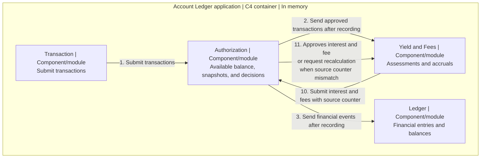

# Architecture

BANK-SPEC is one Clojure/JVM application in memory, without a web layer, database or UI. This document, [tradeoffs](trade-offs.md) and [production considerations](production-considerations.md) form the PDF addressing the [Part 2 requirements](exercise-inputs/architecture-requirements.md).

## Domains and module boundaries

* **Authorization** owns operational transactions, available funds, holds, decisions and snapshots. Transaction entry calls only Authorization.
* **Ledger** owns accounting balances and journals, deduplicated by financial transaction ID. Balanced postings use customer liabilities and same-currency clearing. Opening balances remain configuration.
* **Yield and Fees** owns assessments, accruals, financial intents and settlement receipts. It reconstructs dated bases from approved events and opening state. Neither it nor Authorization reads Ledger balances.

Each domain separates pure `logic`, incoming/outgoing `ports`, atomic local storage in `db`, and internal schemas in `model`, mirrored in tests. Ledger has no outgoing application dependency. Shared arithmetic and validation remain pure.

## Snapshots and concurrency

Recorded IDs, including declines, win before content validation; duplicates repeat no effect. Financial and hold changes create snapshots, advancing the counter by one from 1; declines record only identity/decision. Check identity and base version atomically with recording the outcome/effects. A changed base requires recalculation with the same ID. No module lock spans another module call; uncommitted attempts publish nothing.

## Calculation version validation

Unrecorded interest and fee commands require `source_event_counter` equal to Authorization's current counter. For source 10 against current 11, record no payment; receive event 11 and recalculate with the same unrecorded ID. Never replace only the counter. A financial booking cutoff does not remove this version check.

Yield saves the complete command before submission: ID, amount, dates, source, component links and fee assessment where applicable. Unknown outcomes retain that exact command for confirmation or identical retry. Definite invalid/stale rejection permits a fresh proposal while preserving intent history. Confirmed results, confirmed duplicates or committed events atomically record the original assessment/receipt and clear pending state before another settlement selects components. Pending commands block other Yield fees/payments, including zero settlements, but not principal credits/debits. Jobs are serial; each fee is confirmed and delivered before the next proposal.

## Delivery, time and reports

The dispatcher sends recorded envelopes to Yield and financial events to Ledger, acknowledging recipients independently. Explicit drains retry failures. Completeness requires the contiguous approved prefix, including holds, no pending financial command and no known pending delivery; this cannot prove future external completeness. Recovery ends at process exit.

Value date controls economic effect; booking date controls input eligibility; account counter/journal position bounds observed state. Receipt is separate. Daily D jobs use bookings through D-1 and effects through the calculated day. Corrections append linked differences; pending interest is outside balances and earns nothing. Captured reports stay immutable. Live cross-module reads are non-atomic and trigger no recovery; historical accounting uses explicit date/position bounds.

[Example 08](examples/08-daily-closing.md#executable-historical-views) alone permits a principal-input bound with `:interest-only? true`, without fee proposals. Default jobs use all eligible inputs.

See [API](api.md) and [CONTRACTS](implementation/bank-spec/CONTRACTS.md) for interfaces; [NUMBERS](deliverables/NUMBERS.md) and [AMBIGUITIES](deliverables/AMBIGUITIES.md) for financial rules and decisions.

## C3 component view

This logical C3 (C4 Level 3) view shows components inside one application. Numbers label interactions, not event counters or execution order. Calculation has an independent trigger.

